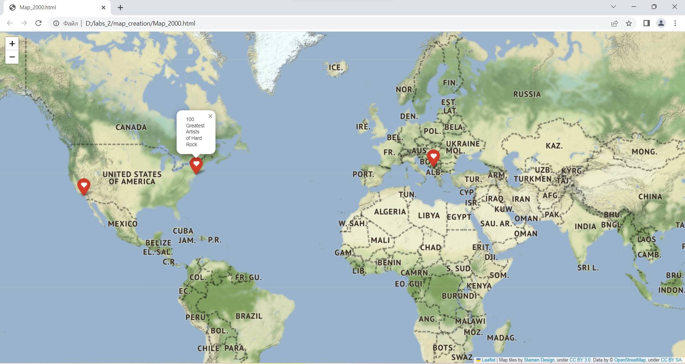

# map_creation
This module is created for generating a map with 10 or less the nearest locations where the films in the given year were made.

it has three functions:
1. read_file(file_path: str): reads file and yields one line to optimize process of analysing

2. get_films(file_path: str, year: int, latitude: float, longitude: float) -> list: analyses file with films and returns 10 of them in the nearest locations

3. generate_map(file_path: str, year: int, latitude: float, longitude: float): generates a map with 10 or less popups with films

Some useful information which user can get from it:
1. exact place of the 'motherhood' of some films (maybe he/she is a tourist and wants to visit some interesting places)
2. places where the biggest amount of films were made (Broadway, for example)
3. comparison of the amount of the films which were made on a small area during each year

let's try generating a map after writing this in terminal:

python main.py 2000 49.83826 24.02324 locations_0.list

the file is small so we get only 3 films which were made in this year and here is the map:

I will leave it in the repository and the list of films too so you can try it by yourself